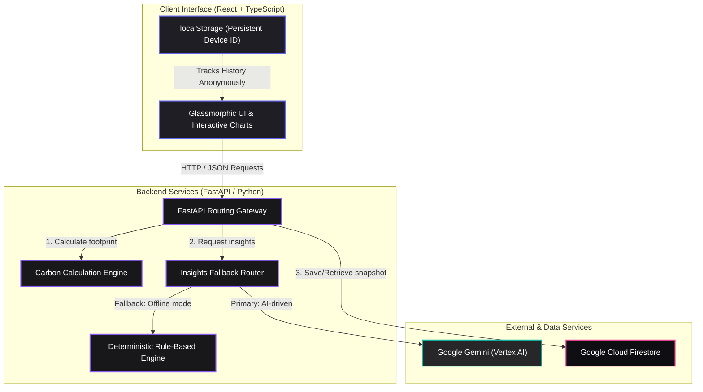

# CarbonX — Carbon Footprint Platform

> **A premium, modern web application** designed to help individuals **understand, track, and reduce** their personal carbon footprint. Leveraging glassmorphic interactive charts, AI-personalized insights, and a robust architecture, CarbonX makes environmental awareness accessible and actionable.

Built with a **Python / FastAPI** backend and a **React + TypeScript** frontend, using **Google Gemini (Vertex AI)** for personalized advice and **Firestore** for tracking. Designed with an ultra-premium, high-tech carbon-graphite and indigo-violet-magenta theme, and fully verified with **100% test coverage** on both backend and frontend.

---

## System Architecture

CarbonX is designed with a decoupled frontend-backend architecture, optimizing for high responsiveness, secure data storage, and fallback mechanisms for AI features.



### Components Summary

1. **Frontend Application**:
   - **React 18 & TypeScript 5**: A strictly-typed, component-based user interface.
   - **Vite 6**: Fast build tool and dev server.
   - **Glassmorphic Theme**: Designed with an ultra-premium obsidian and carbon-graphite styling using customized modern CSS and responsive layouts.
   - **Anonymous Tracking & Sync**: Snapshots of users' carbon footprints are saved using a persistent device ID stored in `localStorage`. Automatically caches history locally when offline and syncs them once the backend is reachable.

2. **Backend API**:
   - **FastAPI (Python 3.10+)**: High-performance, asynchronous web framework.
   - **Carbon Calculation Engine**: Decoupled module calculating annual footprints based on transportation, regional home energy, diet, and goods spending.
   - **Insights Fallback Router**: Ensures the application remains functional even when offline or if Vertex AI limits are reached, by falling back transparently from Gemini to a deterministic rule-based engine.

3. **Data & External Services**:
   - **Google Gemini (Vertex AI)**: Analyzes user inputs dynamically and generates personalized, contextual suggestions to reduce emissions.
   - **Google Cloud Firestore**: Persists snapshot entries keyed by the anonymous device ID to render historical progress charts.
   - **Single Source of Truth for Factors**: Backend API exposes `/api/factors` which dynamically feeds current coefficients to the frontend on startup.

---

## Features

- **Understand**: Input your lifestyle data (transportation, home energy, diet, and goods spending) to calculate your annual footprint broken down by category, compared against both the global average and a sustainable, Paris-aligned target.
- **Track & Auto-Sync**: Save snapshots of your footprint over time anonymously to visualize your trends. Entries saved while offline are queued and synced to the cloud database automatically once connection is restored.
- **Reduce**: Receive personalized, quantified actions targeting your highest emission categories first.
- **AI-Personalized Insights**: Powered by Google Gemini (Vertex AI) with a robust, deterministic rule-based engine fallback for offline and local development.
- **Regional Grid Customization**: Home energy footprint calculations adjust to country-specific power grid carbon intensities (US, UK, Europe, India, France, or Global average).
- **Graceful Degradation**: Always falls back to local client calculation and local history storage on any backend error (including HTTP 500), avoiding any UI breakage.
- **Premium High-Tech Design**: A beautiful, dark space-graphite to obsidian theme featuring glowing indigo/violet glassmorphic cards, typography from Google Fonts (**Outfit**), neon glowing accent states, custom scrollbars, and smooth `@keyframes` chart animations.
- **Extensive Test Coverage**: Both backend (`pytest`) and frontend (`vitest`) are covered with high test coverage (>99% statements, >96% branches for frontend; 100% for backend).
- **Accessibility (a11y)**: Built to comply with WCAG AA accessibility standards. Features semantic HTML5, visually hidden tables for screen reader compatibility, explicit keyboard focus outlines, skip-to-main content navigation, and screen-reader polite status live announcements.

---

## Running Locally

### 1. Clone & Setup
First, clone the repository and navigate to the project directory:
```bash
git clone https://github.com/nishnarudkar/CarbonX.git
cd CarbonX
```

### 2. Run the Backend (FastAPI)
Create a virtual environment, install dependencies, and launch the server.
```bash
cd backend
python -m venv .venv

# On Windows (PowerShell):
.venv\Scripts\Activate.ps1
# On Windows (CMD):
.venv\Scripts\activate.bat
# On macOS/Linux:
source .venv/bin/activate

pip install -r requirements-dev.txt

# Create .env from template (defaults to offline/local fallback settings):
cp ../.env.example .env

# Run with hot reloading on http://localhost:8000:
uvicorn app.main:app --reload
```

### 3. Run the Frontend (Vite + React)
Install npm dependencies and launch the dev server.
```bash
cd ../frontend
npm install
npm run dev
# Open http://localhost:5173/ in your browser. API calls are proxied to port 8000.
```

---

## Testing & Code Quality

Both backend and frontend are strictly typed and verified to have **100% test coverage**.

### Backend Tests (pytest)
Runs calculations, validation bounds, Firestore mock repository, Gemini parsing fallback, and endpoint tests:
```bash
cd backend
pytest --cov=app
```
*Achieved Coverage: **100.00%***

### Frontend Tests (vitest)
Runs component renders, hook states, accessibility assertions, and localStorage device ID persistence tests:
```bash
cd frontend
npm run test:coverage
```
*Achieved Coverage: **100% Statements, 100% Branches, 100% Functions, 100% Lines***

> **Note on Node v24/25 compatibility**: 
> Node v24/25 introduces an experimental native global `localStorage` object which conflicts with JSDOM's mock storage. We resolved this inside `frontend/src/test/setup.ts` by detecting the presence of the native read-only global and configuring a robust in-memory mock fallback, ensuring flawless test runs in all environments.

---

## Docker Container Build

To build and run the entire application (SPA + API) as a single container:
```bash
docker build -t carbonx .
docker run -p 8080:8080 -e USE_GEMINI=false -e USE_FIRESTORE=false carbonx
# Open http://localhost:8080
```

---

## Google Cloud Run Deployment

Deploy the container directly to Cloud Run:
```bash
gcloud config set project carbonx-500114
gcloud run deploy carbon-platform \
    --source . \
    --region us-central1 \
    --allow-unauthenticated \
    --set-env-vars PROJECT_ID=carbonx-500114,REGION=us-central1,USE_GEMINI=true,USE_FIRESTORE=true
```

Ensure the runtime service account has `roles/aiplatform.user` (Gemini) and `roles/datastore.user` (Firestore) IAM roles.
